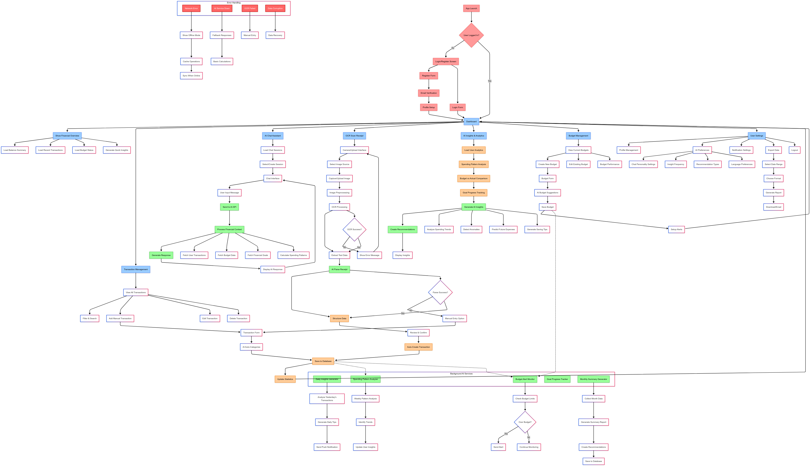

# Fin AI

**Fin AI** adalah aplikasi web untuk membantu mencatat dan mengelola keuangan pribadi dengan teknologi AI. Aplikasi ini mampu memahami input transaksi dalam bentuk bahasa manusia, memberikan analisis keuangan otomatis, serta membantu merencanakan anggaran dan pengeluaran secara pintar dan efisien.

## ✨ Fitur

### 🔍 Fitur AI

- Input transaksi keuangan dengan prompt
- Prediksi pengeluaran bulanan berdasarkan histori
- Chat AI untuk konsultasi keuangan pribadi
- OCR untuk membaca dan mencatat dari struk belanja
- Perencanaan keuangan jangka pendek dan panjang
- Rekomendasi pengelolaan keuangan bulanan
- Smart Summary (ringkasan keuangan otomatis)

### 📋 Fitur Non-AI

- Riwayat transaksi keuangan lengkap
- Laporan keuangan bulanan dan tahunan

## 🛠️ Tech Stack

- **Golang** – Backend utama
- **Fiber** – Web framework Golang
- **PostgreSQL** – Penyimpanan data transaksi
- **PGvector** – Extensi PostgreSQL untuk penyimpanan vektor AI (untuk semantic search)
- **Redis** – Caching dan penyimpanan sesi
- **Tesseract OCR** – Optical Character Recognition untuk membaca struk
- **ImageMagick** – Image processing untuk optimasi gambar
- **Minio** – Penyimpanan file untuk struk belanja
- **OpenAI GPT-4.1** – Model AI untuk input, insight, dan percakapan
- **Docker** – Containerization dan deployment

---

## 🚀 Instalasi

```bash
git clone https://github.com/saufiroja/fin-ai.git
cd fin-ai

cp .env.example .env

docker-compose up --build
```

Akses aplikasi di: `http://localhost:8080`
Database migration berjalan otomatis saat container aktif.

---

## 📚 API Documentation

### 1. Authentication

| Method | Endpoint                | Deskripsi     |
| ------ | ----------------------- | ------------- |
| POST   | `/api/v1/auth/register` | Register user |
| POST   | `/api/v1/auth/login`    | Login user    |
| POST   | `/api/v1/auth/logout`   | Logout user   |
| POST   | `/api/v1/auth/refresh`  | Refresh token |

### 2. User

| Method | Endpoint                | Deskripsi           |
| ------ | ----------------------- | ------------------- |
| GET    | `/api/v1/user`          | Get user profile    |
| PUT    | `/api/v1/user/:user_id` | Update user profile |
| DELETE | `/api/v1/user/:user_id` | Delete user profile |

### 3. Transactions

| Method | Endpoint                               | Deskripsi                                |
| ------ | -------------------------------------- | ---------------------------------------- |
| GET    | `/api/v1/transactions`                 | List with filters (date, category, type) |
| POST   | `/api/v1/transactions`                 | Create new transaction                   |
| GET    | `/api/v1/transactions/:transaction_id` | Get specific transaction                 |
| PUT    | `/api/v1/transactions/:transaction_id` | Update transaction                       |
| DELETE | `/api/v1/transactions/:transaction_id` | Delete transaction                       |
| GET    | `/api/v1/transactions/stats`           | Transaction statistics                   |

### 4. Categories

| Method | Endpoint                     | Deskripsi           |
| ------ | ---------------------------- | ------------------- |
| GET    | `/api/v1/categories`         | Get all categories  |
| POST   | `/api/v1/categories`         | Create new category |
| PUT    | `/api/v1/categories/:cat_id` | Update category     |
| DELETE | `/api/v1/categories/:cat_id` | Delete category     |

### 5. Budgets

| Method | Endpoint                     | Deskripsi                  |
| ------ | ---------------------------- | -------------------------- |
| GET    | `/api/v1/budgets`            | List budgets by month/year |
| POST   | `/api/v1/budgets`            | Create new report          |
| GET    | `/api/v1/budgets/:report_id` | Get specific budget        |
| PUT    | `/api/v1/budgets/:report_id` | Update report by ID        |
| DELETE | `/api/v1/budgets/:report_id` | Delete report by ID        |
| GET    | `/api/v1/budgets/status`     | Budget vs actual spending  |

### 6. OCR & Receipts

| Method | Endpoint                               | Deskripsi               |
| ------ | -------------------------------------- | ----------------------- |
| POST   | `/api/v1/receipts/upload`              | Upload receipt image    |
| GET    | `/api/v1/receipts`                     | List user receipts      |
| GET    | `/api/v1/receipts/:receipt_id`         | Get specific receipt    |
| DELETE | `/api/v1/receipts/:receipt_id`         | Delete receipt          |
| POST   | `/api/v1/receipts/:receipt_id/extract` | Re-extract receipt data |
| POST   | `/api/v1/receipts/:receipt_id/confirm` | Confirm receipt data    |

### 7. AI Chat

| Method | Endpoint                                        | Deskripsi                      |
| ------ | ----------------------------------------------- | ------------------------------ |
| GET    | `/api/v1/ai/chat/sessions`                      | List chat sessions             |
| POST   | `/api/v1/ai/chat/sessions`                      | Create new chat session        |
| GET    | `/api/v1/ai/chat/sessions/:session_id`          | Get chat session with messages |
| DELETE | `/api/v1/ai/chat/sessions/:session_id`          | Delete chat session            |
| POST   | `/api/v1/ai/chat/sessions/:session_id/messages` | Send message to chat session   |

### 8. AI Insights & Analytics

| Method | Endpoint                          | Deskripsi                  |
| ------ | --------------------------------- | -------------------------- |
| GET    | `/api/v1/ai/insights`             | List user insights         |
| GET    | `/api/v1/ai/insights/monthly`     | Get monthly insights       |
| GET    | `/api/v1/ai/insights/weekly`      | Get weekly insights        |
| GET    | `/api/v1/ai/insights/yearly`      | Get yearly insights        |
| POST   | `/api/v1/ai/insights/generated`   | Trigger insight generation |
| GET    | `/api/v1/ai/analytics/spending`   | Spending analytics         |
| GET    | `/api/v1/ai/analytics/saving`     | Saving analytics           |
| GET    | `/api/v1/ai/analytics/trends`     | Spending trends            |
| GET    | `/api/v1/ai/analytics/categories` | Category breakdown         |

### 9. Financial Goals

| Method | Endpoint                       | Deskripsi            |
| ------ | ------------------------------ | -------------------- |
| GET    | `/api/v1/goals`                | List financial goals |
| POST   | `/api/v1/goals`                | Create new goal      |
| GET    | `/api/v1/goals/:goal_id`       | Get specific goal    |
| PUT    | `/api/v1/goals/:goal_id`       | Update goal          |
| DELETE | `/api/v1/goals/:goal_id`       | Delete goal          |
| POST   | `/api/v1/goals/:goal_id/track` | Track goal progress  |

### 10. AI Summary

| Method | Endpoint                    | Deskripsi                            |
| ------ | --------------------------- | ------------------------------------ |
| GET    | `/api/v1/summaries`         | List summaries                       |
| GET    | `/api/v1/summaries/monthly` | Monthly summary                      |
| GET    | `/api/v1/summaries/weekly`  | Weekly summary                       |
| POST   | `/api/v1/summaries`         | Generate summary for specific period |

### 12. Dashboard & Reports

| Method | Endpoint                  | Deskripsi                          |
| ------ | ------------------------- | ---------------------------------- |
| GET    | `/api/v1/dashboard`       | Get user dashboard data            |
| GET    | `/api/v1/reports/monthly` | Get monthly financial report       |
| GET    | `/api/v1/reports/weekly`  | Get weekly financial report        |
| GET    | `/api/v1/reports/yearly`  | Get yearly financial report        |
| GET    | `api/v1/reports/export`   | Export financial report to CSV/PDF |

### 13. Settings & Preferences

| Method | Endpoint              | Deskripsi            |
| ------ | --------------------- | -------------------- |
| GET    | `/api/v1/settings`    | Get user settings    |
| PUT    | `/api/v1/settings`    | Update user settings |
| GET    | `/api/v1/settings/ai` | AI-specific settings |
| PUT    | `/api/v1/settings/ai` | Update AI Preference |

### 14. Webhooks (For background processing)

| Method | Endpoint                           | Deskripsi               |
| ------ | ---------------------------------- | ----------------------- |
| POST   | `/api/v1/webhooks/daily/insights`  | Trigger daily insights  |
| POST   | `/api/v1/webhooks/weekly/summary`  | Trigger weekly summaryy |
| POST   | `/api/v1/webhooks/monthly/summary` | Trigger monthly summary |

# Financial Tracker AI - Application Flow Documentation

## 1. 🔐 Authentication Flow

### Registration Process

```
User Opens App → Check Token → No Token → Registration Screen
├── Fill Registration Form (Name, Email, Password)
├── Submit to API: POST /api/v1/auth/register
├── Email Verification (Optional)
├── Profile Setup (Currency, Timezone)
└── Generate JWT Token → Navigate to Dashboard
```

### Login Process

```
Login Screen → Submit Credentials
├── API Call: POST /api/v1/auth/login
├── Validate Credentials
├── Generate JWT Token
├── Store Token in Secure Storage
└── Navigate to Dashboard
```

---

## 2. 📊 Dashboard Flow

### Initial Load Sequence

```
Dashboard Mount
├── Load User Profile: GET /api/v1/auth/profile
├── Load Financial Summary: GET /api/v1/dashboard
│   ├── Total Income/Expense (Current Month)
│   ├── Budget Status
│   └── Account Balance
├── Load Recent Transactions: GET /api/v1/transactions?limit=5
└── Generate Quick Insights: GET /api/v1/insights?type=quick
```

### Real-time Updates

```
Every Transaction Created/Updated
├── Update Dashboard Statistics
├── Refresh Budget Status
├── Trigger Background AI Analysis
└── Update UI Components
```

---

## 3. 💳 Transaction Management Flow

### View Transactions

```
Transactions Screen Load
├── API Call: GET /api/v1/transactions
├── Apply Filters (Date, Category, Type)
├── Pagination Support
├── Search Functionality
└── Display with AI-Generated Categories
```

### Add Transaction (Manual)

```
Add Transaction Button → Transaction Form
├── Fill Form Data
├── AI Auto-Categorization
│   ├── Analyze Description
│   ├── Compare with Historical Data
│   └── Suggest Category (with confidence score)
├── Submit: POST /api/v1/transactions
├── Update Local State
├── Refresh Dashboard
└── Trigger Background AI Processing
```

### Transaction Processing Pipeline

```
New Transaction Created
├── Save to Database
├── Update User Statistics
├── Check Budget Limits
├── Trigger AI Analysis
│   ├── Pattern Recognition
│   ├── Anomaly Detection
│   └── Update Spending Insights
└── Send Notifications (if needed)
```

---

## 4. 🤖 AI Chat Assistant Flow

### Chat Session Management

```
Chat Screen Load
├── Load Chat Sessions: GET /api/v1/chat/sessions
├── Select/Create Session
└── Load Chat History: GET /api/v1/chat/sessions/{id}
```

### Message Processing

```
User Sends Message
├── Display User Message
├── Show "AI Thinking" Indicator
├── Build Context for AI:
│   ├── GET /api/v1/transactions (Recent)
│   ├── GET /api/v1/budgets (Current)
│   ├── GET /api/v1/insights (Latest)
│   └── GET /api/v1/analytics/spending
├── Send to AI API: POST /api/v1/chat/sessions/{id}/messages
│   ├── Message + Context
│   ├── LLM Processing (GPT-4)
│   ├── Generate Response
│   └── Log Conversation
└── Display AI Response
```

### AI Context Building

```go
func buildAIContext(userID string) map[string]interface{} {
    context := make(map[string]interface{})
    context["recent_transactions"] = getRecentTransactions(userID, 20)
    context["monthly_summary"] = getMonthlySummary(userID)
    context["budget_status"] = getBudgetStatus(userID)
    context["financial_goals"] = getFinancialGoals(userID)
    context["spending_patterns"] = analyzeSpendingPatterns(userID)
    context["user_preferences"] = getUserPreferences(userID)
    return context
}
```

---

## 5. 📷 OCR Receipt Processing Flow

### Image Upload & Processing

```
Upload Receipt Image
├── Image Validation (Size, Format)
├── Image Preprocessing:
│   ├── Resize & Optimize
│   ├── Enhance Contrast
│   ├── Noise Reduction
│   └── Orientation Correction
├── OCR Processing (Tesseract):
│   ├── Text Extraction
│   ├── Confidence Scoring
│   └── Raw Text Output
├── AI Text Processing (GPT-4):
│   ├── Parse Receipt Structure
│   ├── Extract Merchant Info
│   ├── Extract Items & Prices
│   ├── Calculate Total
│   └── Suggest Category
└── Present Results for Review
```

### OCR Result Processing

```
OCR Results Retrieved
├── Display Parsed Data
├── User Review & Edit
├── Confirm Transaction Creation
├── Save Receipt: POST /api/v1/receipts
├── Create Transaction: POST /api/v1/transactions
└── Update Dashboard
```

### Error Handling

```
OCR Processing Failed
├── Show Error Message
├── Provide Manual Entry Option
├── Allow Re-upload
└── Log Error for Analysis
```

---

## 6. 💡 AI Insights & Analytics Flow

### Insights Generation

```
Insights Screen Load
├── Load User Analytics: GET /api/v1/analytics
├── Background Processing:
│   ├── Spending Pattern Analysis
│   ├── Budget Performance Review
│   ├── Goal Progress Tracking
│   ├── Anomaly Detection
│   └── Trend Prediction
├── Generate AI Insights: POST /api/v1/insights/generate
└── Display Personalized Recommendations
```

### Types of AI Analysis

```
Spending Pattern Analysis
├── Daily/Weekly/Monthly Trends
├── Category-wise Breakdown
├── Peak Spending Times
├── Recurring Transaction Detection
└── Seasonal Pattern Recognition

Budget Analysis
├── Budget vs Actual Comparison
├── Overspending Alerts
├── Optimization Suggestions
├── Future Budget Recommendations
└── Savings Opportunities

Goal Tracking
├── Progress Monitoring
├── Achievement Prediction
├── Strategy Adjustments
└── Milestone Celebrations
```

---

## 7. 🎯 Budget Management Flow

### Budget Creation

```
Create Budget
├── Budget Form with AI Suggestions
├── Historical Spending Analysis
├── Recommended Budget Amounts
├── Submit: POST /api/v1/budgets
├── Setup Alert Thresholds
└── Schedule Monitoring Jobs
```

### Budget Monitoring

```
Daily Budget Check (Background Job)
├── Calculate Current Spending
├── Compare with Budget Limits
├── Check Alert Thresholds:
│   ├── 50% Budget Used
│   ├── 80% Budget Used
│   ├── 100% Budget Exceeded
├── Send Notifications
└── Update Budget Status
```

---

## 8. 🔄 Background AI Services

### Daily Insights Generator

```go
func dailyInsightsJob() {
    for _, user := range activeUsers {
        yesterdayData := getTransactions(user, yesterday)
        insights := generateDailyInsights(yesterdayData)
        saveInsights(user, insights)
        sendNotification(user, insights.summary)
    }
}
```

### Weekly Pattern Analyzer

```go
func weeklyPatternAnalysisJob() {
    for _, user := range activeUsers {
        weekData := getTransactions(user, last7Days)
        patterns := analyzeSpendingPatterns(weekData)
        recommendations := generateRecommendations(patterns)
        updateUserInsights(user, patterns, recommendations)
    }
}
```

### Monthly Summary Generator

```go
func monthlySummaryJob() {
    for _, user := range activeUsers {
        monthData := getTransactions(user, last30Days)
        summary := generateMonthlySummary(monthData)
        report := createSummaryReport(summary)
        saveSummary(user, report)
        sendMonthlyEmail(user, report)
    }
}
```

---

## 9. 📱 Real-time Features

### Push Notifications

```
Notification Triggers:
├── Budget Threshold Reached (50%, 80%, 100%)
├── Unusual Spending Detected
├── Daily Insights Available
├── Goal Milestone Reached
├── Bill Reminder (if recurring transaction detected)
└── Weekly/Monthly Summary Ready
```

### Live Updates

```
Real-time Dashboard Updates:
├── New Transaction Added → Update Balance
├── Budget Modified → Refresh Budget Status
├── Goal Progress → Update Progress Bars
└── AI Insights Generated → Show Notification Badge
```

---

## 10. 🛡️ Error Handling & Offline Support

### Network Error Handling

```
Network Connection Lost
├── Switch to Offline Mode
├── Cache User Operations
├── Store in Local Database
├── Show Offline Indicator
└── Sync When Connection Restored
```

### AI Service Downtime

```
AI Service Unavailable
├── Use Cached Responses
├── Provide Basic Calculations
├── Show Service Status
├── Queue AI Requests for Later
└── Graceful Degradation
```

### Data Validation & Recovery

```
Data Integrity Checks:
├── Transaction Validation
├── Budget Consistency
├── User Data Backup
├── Automatic Recovery
└── Manual Recovery Options
```

---

## 11. 🔧 Technical Implementation Notes

### State Management

```
Global State Structure:
├── user: { profile, preferences, settings }
├── transactions: { items, filters, pagination }
├── budgets: { current, history, alerts }
├── chat: { sessions, activeSession, messages }
├── insights: { current, history, recommendations }
└── ui: { loading, errors, notifications }
```

### API Rate Limiting

```
Rate Limiting Strategy:
├── AI Chat: 100 requests/hour per user
├── OCR Processing: 50 requests/hour per user
├── General API: 1000 requests/hour per user
├── Background Jobs: No limit
└── Caching for frequently accessed data
```

### Performance Optimization

```
Optimization Strategies:
├── Image Compression for OCR
├── Database Query Optimization
├── Redis Caching for AI Responses
├── Lazy Loading for Transactions
├── Background Processing for Heavy AI Tasks
└── CDN for Static Assets
```

---

## 12. 📊 Analytics & Monitoring

### User Behavior Tracking

```
Track User Actions:
├── Feature Usage Statistics
├── AI Chat Engagement
├── OCR Success Rates
├── Insight Interaction Rates
└── User Retention Metrics
```

### System Health Monitoring

```
Monitor System Performance:
├── API Response Times
├── AI Service Uptime
├── OCR Processing Success Rate
├── Database Performance
├── Background Job Status
└── Error Rates & Types
```

---

## 1. 🔐 Authentication Flow

### Registration Process

```
User Opens App → Check Token → No Token → Registration Screen
├── Fill Registration Form (Name, Email, Password)
├── Submit to API: POST /api/v1/auth/register
├── Email Verification (Optional)
├── Profile Setup (Currency, Timezone)
└── Generate JWT Token → Navigate to Dashboard
```

### Login Process

```
Login Screen → Submit Credentials
├── API Call: POST /api/v1/auth/login
├── Validate Credentials
├── Generate JWT Token
├── Store Token in Secure Storage
└── Navigate to Dashboard
```

---

## 2. 📊 Dashboard Flow

### Initial Load Sequence

```
Dashboard Mount
├── Load User Profile: GET /api/v1/auth/profile
├── Load Financial Summary: GET /api/v1/dashboard
│   ├── Total Income/Expense (Current Month)
│   ├── Budget Status
│   └── Account Balance
├── Load Recent Transactions: GET /api/v1/transactions?limit=5
└── Generate Quick Insights: GET /api/v1/insights?type=quick
```

### Real-time Updates

```
Every Transaction Created/Updated
├── Update Dashboard Statistics
├── Refresh Budget Status
├── Trigger Background AI Analysis
└── Update UI Components
```

---

## 3. 💳 Transaction Management Flow

### View Transactions

```
Transactions Screen Load
├── API Call: GET /api/v1/transactions
├── Apply Filters (Date, Category, Type)
├── Pagination Support
├── Search Functionality
└── Display with AI-Generated Categories
```

### Add Transaction (Manual)

```
Add Transaction Button → Transaction Form
├── Fill Form Data
├── AI Auto-Categorization
│   ├── Analyze Description
│   ├── Compare with Historical Data
│   └── Suggest Category (with confidence score)
├── Submit: POST /api/v1/transactions
├── Update Local State
├── Refresh Dashboard
└── Trigger Background AI Processing
```

### Transaction Processing Pipeline

```
New Transaction Created
├── Save to Database
├── Update User Statistics
├── Check Budget Limits
├── Trigger AI Analysis
│   ├── Pattern Recognition
│   ├── Anomaly Detection
│   └── Update Spending Insights
└── Send Notifications (if needed)
```

---

## 4. 🤖 AI Chat Assistant Flow

### Chat Session Management

```
Chat Screen Load
├── Load Chat Sessions: GET /api/v1/chat/sessions
├── Select/Create Session
└── Load Chat History: GET /api/v1/chat/sessions/{id}
```

### Message Processing

```
User Sends Message
├── Display User Message
├── Show "AI Thinking" Indicator
├── Build Context for AI:
│   ├── GET /api/v1/transactions (Recent)
│   ├── GET /api/v1/budgets (Current)
│   ├── GET /api/v1/insights (Latest)
│   └── GET /api/v1/analytics/spending
├── Send to AI API: POST /api/v1/chat/sessions/{id}/messages
│   ├── Message + Context
│   ├── LLM Processing (GPT-4)
│   ├── Generate Response
│   └── Log Conversation
└── Display AI Response
```

### AI Context Building

```python
def build_ai_context(user_id):
    context = {
        "recent_transactions": get_recent_transactions(user_id, limit=20),
        "monthly_summary": get_monthly_summary(user_id),
        "budget_status": get_budget_status(user_id),
        "financial_goals": get_financial_goals(user_id),
        "spending_patterns": analyze_spending_patterns(user_id),
        "user_preferences": get_user_preferences(user_id)
    }
    return context
```

---

## 5. 📷 OCR Receipt Processing Flow

### Image Upload & Processing

```
Upload Receipt Image
├── Image Validation (Size, Format)
├── Image Preprocessing:
│   ├── Resize & Optimize
│   ├── Enhance Contrast
│   ├── Noise Reduction
│   └── Orientation Correction
├── OCR Processing (Tesseract):
│   ├── Text Extraction
│   ├── Confidence Scoring
│   └── Raw Text Output
├── AI Text Processing (GPT-4):
│   ├── Parse Receipt Structure
│   ├── Extract Merchant Info
│   ├── Extract Items & Prices
│   ├── Calculate Total
│   └── Suggest Category
└── Present Results for Review
```

### OCR Result Processing

```
OCR Results Retrieved
├── Display Parsed Data
├── User Review & Edit
├── Confirm Transaction Creation
├── Save Receipt: POST /api/v1/receipts
├── Create Transaction: POST /api/v1/transactions
└── Update Dashboard
```

### Error Handling

```
OCR Processing Failed
├── Show Error Message
├── Provide Manual Entry Option
├── Allow Re-upload
└── Log Error for Analysis
```

---

## 6. 💡 AI Insights & Analytics Flow

### Insights Generation

```
Insights Screen Load
├── Load User Analytics: GET /api/v1/analytics
├── Background Processing:
│   ├── Spending Pattern Analysis
│   ├── Budget Performance Review
│   ├── Goal Progress Tracking
│   ├── Anomaly Detection
│   └── Trend Prediction
├── Generate AI Insights: POST /api/v1/insights/generate
└── Display Personalized Recommendations
```

### Types of AI Analysis

```
Spending Pattern Analysis
├── Daily/Weekly/Monthly Trends
├── Category-wise Breakdown
├── Peak Spending Times
├── Recurring Transaction Detection
└── Seasonal Pattern Recognition

Budget Analysis
├── Budget vs Actual Comparison
├── Overspending Alerts
├── Optimization Suggestions
├── Future Budget Recommendations
└── Savings Opportunities

Goal Tracking
├── Progress Monitoring
├── Achievement Prediction
├── Strategy Adjustments
└── Milestone Celebrations
```

---

## 7. 🎯 Budget Management Flow

### Budget Creation

```
Create Budget
├── Budget Form with AI Suggestions
├── Historical Spending Analysis
├── Recommended Budget Amounts
├── Submit: POST /api/v1/budgets
├── Setup Alert Thresholds
└── Schedule Monitoring Jobs
```

### Budget Monitoring

```
Daily Budget Check (Background Job)
├── Calculate Current Spending
├── Compare with Budget Limits
├── Check Alert Thresholds:
│   ├── 50% Budget Used
│   ├── 80% Budget Used
│   ├── 100% Budget Exceeded
├── Send Notifications
└── Update Budget Status
```

---

## 8. 🔄 Background AI Services

### Daily Insights Generator

```python
# Runs every morning at 8 AM
def daily_insights_job():
    for user in active_users:
        yesterday_data = get_transactions(user, yesterday)
        insights = generate_daily_insights(yesterday_data)
        save_insights(user, insights)
        send_notification(user, insights.summary)
```

### Weekly Pattern Analyzer

```python
# Runs every Sunday night
def weekly_analysis_job():
    for user in active_users:
        week_data = get_transactions(user, last_7_days)
        patterns = analyze_spending_patterns(week_data)
        recommendations = generate_recommendations(patterns)
        update_user_insights(user, patterns, recommendations)
```

### Monthly Summary Generator

```python
# Runs on 1st of every month
def monthly_summary_job():
    for user in active_users:
        month_data = get_transactions(user, last_month)
        summary = generate_monthly_summary(month_data)
        report = create_summary_report(summary)
        save_summary(user, report)
        send_monthly_email(user, report)
```

---

## 9. 📱 Real-time Features

### Push Notifications

```
Notification Triggers:
├── Budget Threshold Reached (50%, 80%, 100%)
├── Unusual Spending Detected
├── Daily Insights Available
├── Goal Milestone Reached
├── Bill Reminder (if recurring transaction detected)
└── Weekly/Monthly Summary Ready
```

### Live Updates

```
Real-time Dashboard Updates:
├── New Transaction Added → Update Balance
├── Budget Modified → Refresh Budget Status
├── Goal Progress → Update Progress Bars
└── AI Insights Generated → Show Notification Badge
```

---

## 10. 🛡️ Error Handling & Offline Support

### Network Error Handling

```
Network Connection Lost
├── Switch to Offline Mode
├── Cache User Operations
├── Store in Local Database
├── Show Offline Indicator
└── Sync When Connection Restored
```

### AI Service Downtime

```
AI Service Unavailable
├── Use Cached Responses
├── Provide Basic Calculations
├── Show Service Status
├── Queue AI Requests for Later
└── Graceful Degradation
```

### Data Validation & Recovery

```
Data Integrity Checks:
├── Transaction Validation
├── Budget Consistency
├── User Data Backup
├── Automatic Recovery
└── Manual Recovery Options
```

---

## 11. 🔧 Technical Implementation Notes

### State Management

```
Global State Structure:
├── user: { profile, preferences, settings }
├── transactions: { items, filters, pagination }
├── budgets: { current, history, alerts }
├── chat: { sessions, activeSession, messages }
├── insights: { current, history, recommendations }
└── ui: { loading, errors, notifications }
```

### API Rate Limiting

```
Rate Limiting Strategy:
├── AI Chat: 100 requests/hour per user
├── OCR Processing: 50 requests/hour per user
├── General API: 1000 requests/hour per user
├── Background Jobs: No limit
└── Caching for frequently accessed data
```

### Performance Optimization

```
Optimization Strategies:
├── Image Compression for OCR
├── Database Query Optimization
├── Redis Caching for AI Responses
├── Lazy Loading for Transactions
├── Background Processing for Heavy AI Tasks
└── CDN for Static Assets
```

---

## 12. 📊 Analytics & Monitoring

### User Behavior Tracking

```
Track User Actions:
├── Feature Usage Statistics
├── AI Chat Engagement
├── OCR Success Rates
├── Insight Interaction Rates
└── User Retention Metrics
```

### System Health Monitoring

```
Monitor System Performance:
├── API Response Times
├── AI Service Uptime
├── OCR Processing Success Rate
├── Database Performance
├── Background Job Status
└── Error Rates & Types
```

---

This comprehensive flow documentation provides the blueprint for implementing your Financial Tracker AI application. Each flow includes technical details, API endpoints, error handling, and optimization considerations.

## Flow Diagram



## Database


