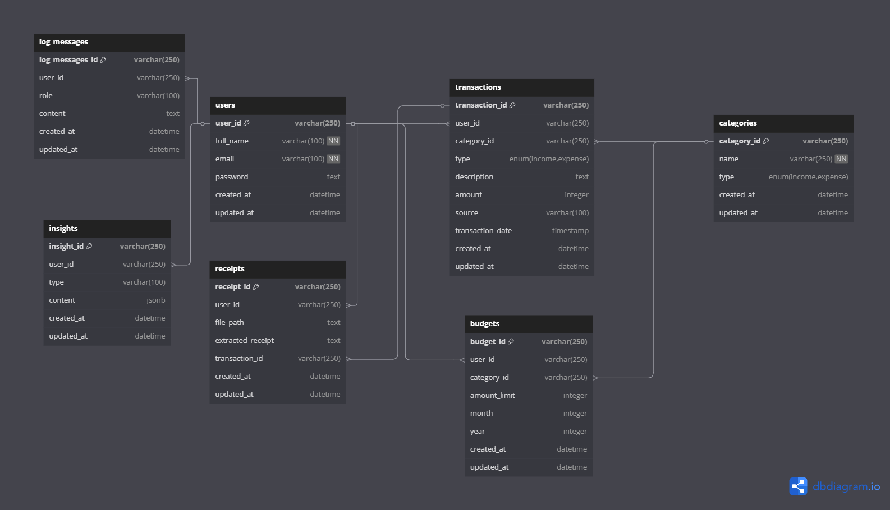

# Fin AI

**Fin AI** adalah aplikasi web untuk membantu mencatat dan mengelola keuangan pribadi dengan teknologi AI. Aplikasi ini mampu memahami input transaksi dalam bentuk bahasa manusia, memberikan analisis keuangan otomatis, serta membantu merencanakan anggaran dan pengeluaran secara pintar dan efisien.

## ✨ Fitur

### 🔍 Fitur AI

- Input transaksi keuangan dengan prompt
- Prediksi pengeluaran bulanan berdasarkan histori
- Chat AI untuk konsultasi keuangan pribadi
- OCR untuk membaca dan mencatat dari struk belanja
- Perencanaan keuangan jangka pendek dan panjang
- Rekomendasi pengelolaan keuangan bulanan
- Smart Summary (ringkasan keuangan otomatis)

### 📋 Fitur Non-AI

- Riwayat transaksi keuangan lengkap
- Laporan keuangan bulanan dan tahunan

## 🛠️ Tech Stack

- **Golang** – Backend utama
- **Fiber** – Web framework Golang
- **PostgreSQL** – Penyimpanan data transaksi
- **OpenAI GPT-4.1** – Model AI untuk input, insight, dan percakapan
- **Docker** – Containerization dan deployment

---

## 🚀 Instalasi

```bash
git clone https://github.com/saufiroja/fin-ai.git
cd fin-ai

cp .env.example .env

docker-compose up --build
```

Akses aplikasi di: `http://localhost:8080`
Database migration berjalan otomatis saat container aktif.

---

## 📚 API Documentation

### 1. 🔐 Authentication

| Method | Endpoint                | Deskripsi     |
| ------ | ----------------------- | ------------- |
| POST   | `/api/v1/auth/register` | Register user |
| POST   | `/api/v1/auth/login`    | Login user    |

### 2. 👤 User

| Method | Endpoint                | Deskripsi     |
| ------ | ----------------------- | ------------- |
| GET    | `/api/v1/user`          | Get user info |
| PUT    | `/api/v1/user/:user_id` | Update user   |
| DELETE | `/api/v1/user/:user_id` | Delete user   |

### 3. 💸 Transactions

| Method | Endpoint                               | Deskripsi                |
| ------ | -------------------------------------- | ------------------------ |
| GET    | `/api/v1/transactions`                 | Get all transactions     |
| GET    | `/api/v1/transactions/:transaction_id` | Get transaction by ID    |
| POST   | `/api/v1/transactions`                 | Create new transaction   |
| PUT    | `/api/v1/transactions/:transaction_id` | Update transaction by ID |
| DELETE | `/api/v1/transactions/:transaction_id` | Delete transaction by ID |

### 4. 📊 Reports

| Method | Endpoint                     | Deskripsi                  |
| ------ | ---------------------------- | -------------------------- |
| GET    | `/api/v1/reports`            | Get monthly/yearly reports |
| GET    | `/api/v1/reports/:report_id` | Get report by ID           |
| POST   | `/api/v1/reports`            | Create new report          |
| PUT    | `/api/v1/reports/:report_id` | Update report by ID        |
| DELETE | `/api/v1/reports/:report_id` | Delete report by ID        |

### 5. 🧠 AI Features

| Method | Endpoint          | Deskripsi                                                  |
| ------ | ----------------- | ---------------------------------------------------------- |
| POST   | `/api/v1/ai/chat` | Endpoint terpadu untuk AI chat, OCR, prediksi, dan lainnya |

#### ✉️ Contoh Payload untuk `/api/v1/ai/chat`

```json
{
  "mode": "ocr", // Atau: "consultation", "summary", "prediction", "planner"
  "message": "Ini struk belanja bulan ini...",
  "file_base64": "..." // Opsional, digunakan jika mode = "ocr"
}
```

- `mode`: Menentukan jenis respons AI yang diminta.
- `message`: Prompt utama dari user.
- `file_base64`: Opsional. Base64 encoded string dari file struk belanja.

Jika `mode` tidak diisi, maka default dianggap sebagai "consultation".

Berikut adalah versi lengkap dari `README.md` yang siap untuk kamu salin dan gunakan:

## 🔄 Fin AI - Application Flow

Dokumentasi alur sistem Fin AI untuk pencatatan dan manajemen keuangan pribadi berbasis AI.

---

### 1. 🧑‍💻 User Interaction

- **User Registration & Login**
  - Endpoint:
    - `POST /api/v1/auth/register`
    - `POST /api/v1/auth/login`
  - Output:
    - JWT Token untuk autentikasi
- **Dashboard Akses**
  - User menggunakan token untuk mengakses seluruh fitur aplikasi

---

### 2. 💸 Transaksi Keuangan

#### a. Input Manual

- Endpoint: `POST /api/v1/transactions`
- Input: Form transaksi seperti kategori, deskripsi, nominal, sumber, tanggal
- Proses:
  - Validasi data
  - Simpan ke tabel `transactions`

##### b. Input via Chat Prompt / OCR

- Endpoint: `POST /api/v1/ai/chat`
- Payload:
  ```json
  {
    "user_id": "uuid",
    "mode": "chat" | "ocr",
    "message": "Saya belanja di Alfamart Rp25.000",
    "image_base64": "base64string (hanya jika mode: ocr)"
  }
  ```

* Proses:

  - Jika `mode = ocr`: lakukan ekstraksi struk dengan OCR
  - Jika `mode = chat`: gunakan model GPT untuk memahami input natural
  - Transaksi yang dikenali disimpan ke tabel `transactions`
  - Riwayat interaksi disimpan ke tabel `log_messages`

---

### 3. 📊 Budget & Laporan

#### a. Budgeting (belum ada API docs nya)

- Endpoint: `POST /api/v1/budgets`
- Input: Kategori, batas anggaran, bulan/tahun
- Proses:

  - Disimpan ke tabel `budgets`
  - Digunakan untuk perbandingan dengan realisasi transaksi

#### b. Laporan Bulanan & Tahunan

- Endpoint: `GET /api/v1/reports`
- Proses:

  - Query semua transaksi berdasarkan rentang waktu
  - Gabungkan dengan informasi budget
  - Buat laporan dalam bentuk summary atau visualisasi

---

### 4. 🤖 AI Features

#### a. Prediksi Pengeluaran

- Endpoint: `POST /api/v1/ai/chat`
- Input: `user_id`
- Proses:

  - Query histori transaksi
  - Gunakan model prediksi untuk estimasi pengeluaran bulan depan

#### b. Smart Summary

- Endpoint: `POST /api/v1/ai/chat`
- Proses:

  - Ambil transaksi bulan berjalan
  - Kirim ke LLM untuk dibuatkan ringkasan keuangan otomatis
  - Gunakan model untuk analisis dan rekomendasi pengeluaran

---

### 5. 📦 Penyimpanan & Struktur Data

#### Database Tables

- `users`: Data pengguna
- `transactions`: Catatan transaksi pengguna
- `categories`: Kategori transaksi (income / expense)
- `budgets`: Batas anggaran per kategori
- `receipts`: Data struk belanja (OCR)
- `log_messages`: Riwayat interaksi dengan AI
- `insights`: Analisis atau insight dari AI (berbasis JSON)

---

### 6. 🐳 Deployment Flow

1. Konfigurasi `.env`
2. Jalankan `docker-compose up --build`
3. Database dan migration berjalan otomatis
4. Akses aplikasi di `http://localhost:8080`

---

### 📌 Catatan

- Semua endpoint memerlukan token JWT (kecuali register/login)
- AI endpoint akan berkembang berdasarkan kebutuhan dan feedback pengguna

## Database


